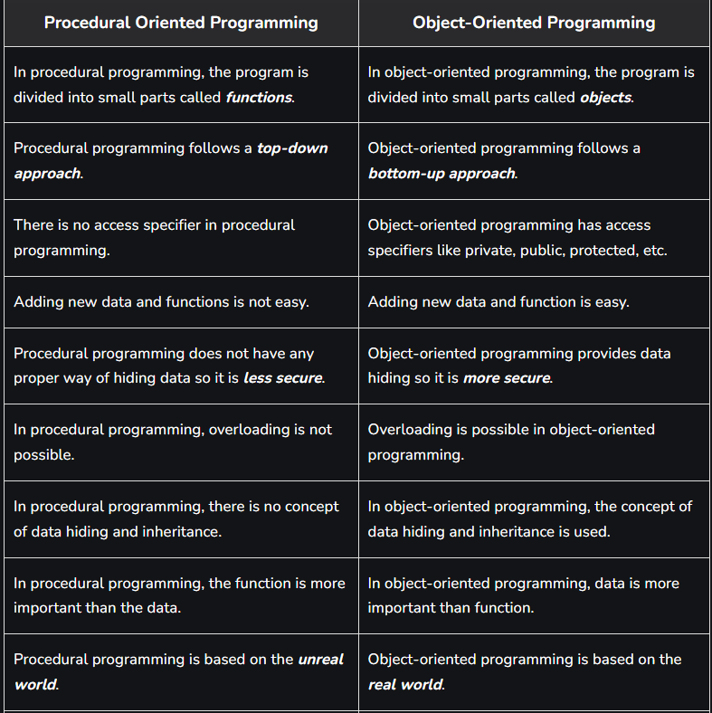
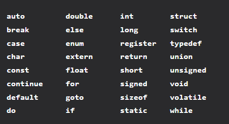
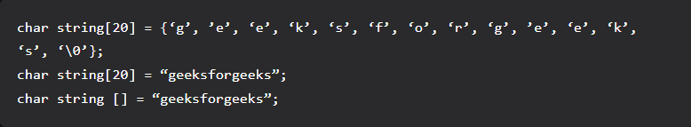
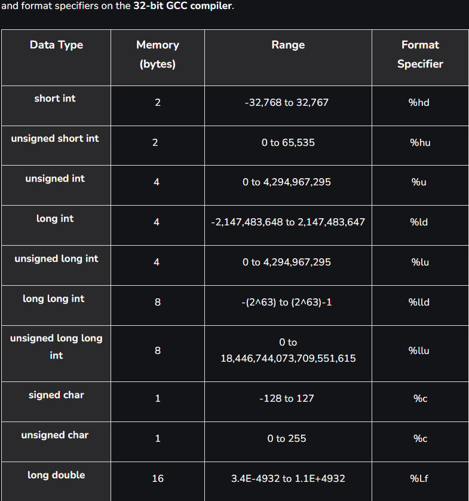

# C Basics

## C Introduction

C is a procedural programming language.

#### Differences between OOPS and Procedural :



#### Main features of C language are :

+ General Purpose and portable 
+ Fast Speed
+ Low-Level Memory Access
+ Clean Syntax
+ Middle-Level Language - Combines both the features of assembly level language and high level language. 
+ Statically Typed - Each variables type is checked which is checked at runtime.

#### Applications of C :
+ Developing Operating Systems.
+ Embedded Systems Development.
+ Database System Development like Oracle. 

#### 2 standards of C to know : 
+ C11
+ C18

#### Disadvantages of C :
+ Lack of automatic memory mangament which can lead to memory leaks or memory bugs, if not managed properly by the user. 
+ No support for concurrency ( like Java ) , which means it doesnt allow multithreading .
+ Security Vulnerable - buffer overflows , unrestricted access to memory .

## Compiling a C Program : Behind the Scenes


1. Creating a program using an editor.

```
vi filename.c
```

2. Compiling the soruce file.
```
gcc filenamce.c -o filename -Wall
```
-Wall -> flag for enabling compiler messages.(Optional)
-o -> To specify output name.(Optional)

3. Executing the program
```
./filename
```

### What goes inside the compilation process?

There are four phases for a C program to become an executable: 

+ Pre-processing
+ Compilation
+ Assembly
+ Linking

#### 1. Pre-processing
This is the first phase through which source code is passed. This phase includes:

+ Removal of Comments
+ Expansion of Macros
+ Expansion of the included files.
+ Conditional compilation

#### 2. Compiling
The next step is to compile filename.i and produce an; intermediate compiled output file filename.s. This file is in assembly-level instructions. 
```
$nano filename.s
```
To see info about compiled language .

#### 3. Assembling

In this phase the filename.s is taken as input and turned into filename.o by the assembler. This file contains machine-level instructions. At this phase, only existing code is converted into machine language, and the function calls like printf() are not resolved.

```
$vi filename.o 
```

To see info about compiled language .

#### 4. Linking

This is the final phase in which all the linking of function calls with their definitions is done.

> C by default does dynamic linking, so printf() is dynamically linked in above program.

Refer to more notes on static and dynamic linking .

### Types of Comments in C


### Tokens in C


##### Keywords

A total of 32 keywords in C .



##### Strings 

Strings are nothing but an array of characters ended with a null character (‘\0’).


##### Some Data Types
